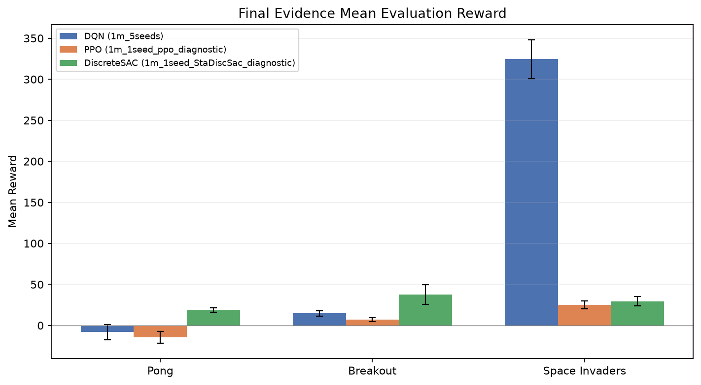
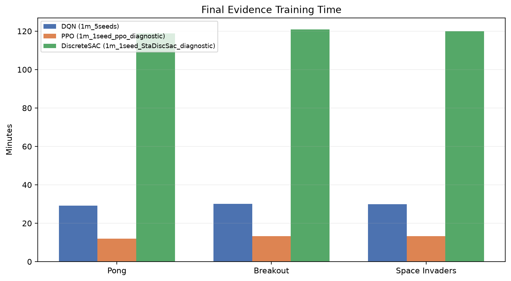

# Benchmarking DQN, PPO, and DiscreteSAC on Atari 2600 Games

[](https://github.com/elsayedelmandoh/atari-rl-benchmarking)
[](https://linktr.ee/elsayedelmandoh)
[](https://www.linkedin.com/in/mohamed-kamal-has/)
[](https://www.linkedin.com/in/mohamed-zidan-adc/)
[](https://www.linkedin.com/in/mostafa-mohie/)
[]()
[](https://x.com/aangpy)

<p align="center">
  
  &nbsp; &nbsp;
  
</p>

Reproducible benchmarking of DQN, PPO, and a custom discrete-action SAC agent on Atari 2600 games using Gymnasium/ALE, Stable Baselines3, PyTorch, and profile-based experiment tracking.

## Table of Contents

- [Overview](#overview)
- [Key Features](#key-features)
- [Final Results Snapshot](#final-results-snapshot)
- [Setup](#setup)
- [Usage](#usage)
- [Project Structure](#project-structure)
- [Important Files](#important-files)
- [Development](#development)
- [License](#license)
- [Contributing](#contributing)
- [Author](#author)

## Overview

This project compares reinforcement learning agents on three Atari environments:

- Pong
- Breakout
- Space Invaders

The benchmark uses pixel observations, shared Atari preprocessing, runtime input-contract validation, checkpointed training, CSV/manifest result tracking, TensorBoard-compatible logs, diagnostic files, and playback videos. DQN and PPO are implemented through Stable Baselines3. SAC is represented by a custom `DiscreteSAC` implementation because standard SB3 SAC is intended for continuous action spaces, while Atari uses discrete actions.

The main deliverable report is available at:

```text
docs/deliverables/02-report.md
```

## Key Features

- Shared Atari preprocessing: grayscale, resize to `84x84`, frame skip, and four-frame stacking.
- Config-driven experiments through `configs/*.json`.
- Named benchmark profiles such as `100k_1seed`, `1m_5seeds`, and diagnostic profiles.
- DQN and PPO baselines through Stable Baselines3.
- Custom categorical-policy DiscreteSAC for Atari discrete action spaces.
- Runtime model input validation before training.
- Per-profile checkpoints, result CSVs, manifests, and playback videos.
- PPO and DiscreteSAC diagnostic CSVs for action entropy, losses, Q statistics, and policy behavior.
- Playback regeneration from saved checkpoints without retraining.

## Final Results Snapshot

The final report highlights one evidence profile per algorithm:

- DQN: `1m_5seeds`
- PPO: `1m_1seed_ppo_diagnostic`
- DiscreteSAC: `1m_1seed_StaDiscSac_diagnostic`

| Algorithm | Pong mean | Breakout mean | Space Invaders mean |
|---|---:|---:|---:|
| DQN | -8.14 | 14.66 | 324.66 |
| PPO | -14.60 | 6.93 | 25.03 |
| DiscreteSAC | 18.77 | 37.42 | 29.44 |

DQN values are means across the five-seed profile. PPO and DiscreteSAC values are final diagnostic-profile means. See `docs/deliverables/02-report.md` for interpretation, caveats, diagnostics, and playback findings.

## Setup

### Prerequisites

- Git
- Python 3.12 recommended
- `uv` recommended for dependency management
- Optional CUDA-capable GPU for faster PyTorch training

### Clone

```bash
git clone https://github.com/elsayedelmandoh/atari-rl-benchmarking.git
cd atari-rl-benchmarking
```

### Install

Recommended:

```bash
uv sync --extra torch --extra rl --extra dev
```

Pip alternative:

```bash
python -m venv .venv
.venv\Scripts\activate
python -m pip install -e ".[torch,rl,dev]"
```

No API keys are required. `.env` is ignored and reserved for local overrides if needed.

## Usage

Run a tiny smoke profile:

```bash
python app.py 64_1seed
```

Run the main completed-style benchmark profile:

```bash
python app.py 1m_5seeds
```

Run DQN final evidence profile only:

```bash
python app.py 1m_5seeds --algo dqn
```

Run PPO diagnostic only:

```bash
python app.py 1m_1seed_ppo_diagnostic --algo ppo
```

Run DiscreteSAC diagnostic only:

```bash
python app.py 1m_1seed_StaDiscSac_diagnostic --algo discretesac
```

Run one algorithm on one game:

```bash
python app.py 1m_1seed_StaDiscSac_diagnostic --algo discretesac --env pong
```

Regenerate playback from existing checkpoints:

```bash
python -m src.inference.record_playback 1m_1seed_StaDiscSac_diagnostic pong
python -m src.inference.record_playback 1m_1seed_StaDiscSac_diagnostic all
```

Regenerate final figures used by the report:

```bash
python evals/analyze_pilot.py
```

## Project Structure

```text
atari-rl-benchmarking/
  app.py                         Main benchmark runner
  configs/                       Environment, algorithm, preprocessing, and profile configs
  src/
    config/                      Settings, config loading, logging
    evaluation/                  Input contracts, metadata, metrics, reporting helpers
    inference/                   Playback regeneration helpers
    models/                      DQN, PPO, DiscreteSAC, training harness
    utils/                       Atari environment creation and helper utilities
  evals/
    checkpoints/                 Result CSVs, manifests, checkpoints, diagnostics
    figures/                     Analysis figures
  artifacts/
    preparing/input_samples/     Raw and preprocessed observation samples
    evaluation/playback/         MP4 playback videos
  docs/
    deliverables/                Proposal/report materials
    project-definition/          Problem, scope, architecture, workflow notes
  logs/                          TensorBoard events and process logs
  tests/                         Unit tests
```

## Important Files

- `docs/deliverables/02-report.md`: final project report.
- `docs/project-reference-guide.md`: technical guide to the project.
- `configs/benchmark.json`: named run profiles.
- `configs/algorithms.json`: DQN/PPO/DiscreteSAC settings.
- `evals/checkpoints/<profile>/*_results_*.csv`: result tables.
- `artifacts/evaluation/playback/<profile>/`: playback videos.
- `evals/figures/*.png`: report figures generated from the final evidence profiles.

## Development

Run tests:

```bash
uv run pytest tests/ -v
```

Lint:

```bash
uv run ruff check src tests app.py
```

Format:

```bash
uv run ruff format src tests app.py
```

## License

MIT. See `LICENSE`.

## Contributing

Contributions are welcome. To propose a change:

1. Fork the repository.
2. Create a feature branch.
3. Make focused changes with clear commits.
4. Run tests and lint checks when possible.
5. Open a pull request with a short summary and any relevant results.

## Author

- Elsayed Elmandoh - NLP engineer - [Linktree](https://linktr.ee/elsayedelmandoh)
- Mohamed Hasan - data scientist - [LinkedIn](https://www.linkedin.com/in/mohamed-kamal-has/)
- Mohamed Zidan - AI engineer - [LinkedIn](https://www.linkedin.com/in/mohamed-zidan-adc/)
- Mostafa Elofy - AI engineer - [LinkedIn](https://www.linkedin.com/in/mostafa-mohie/)
