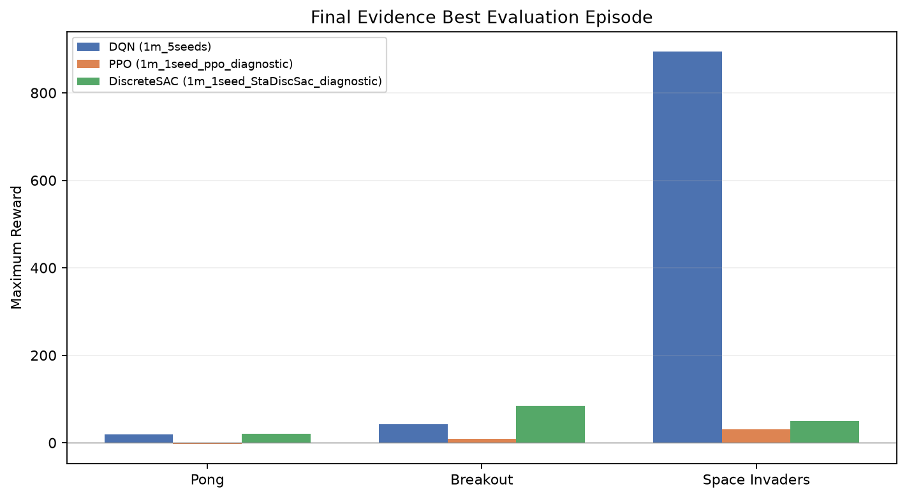
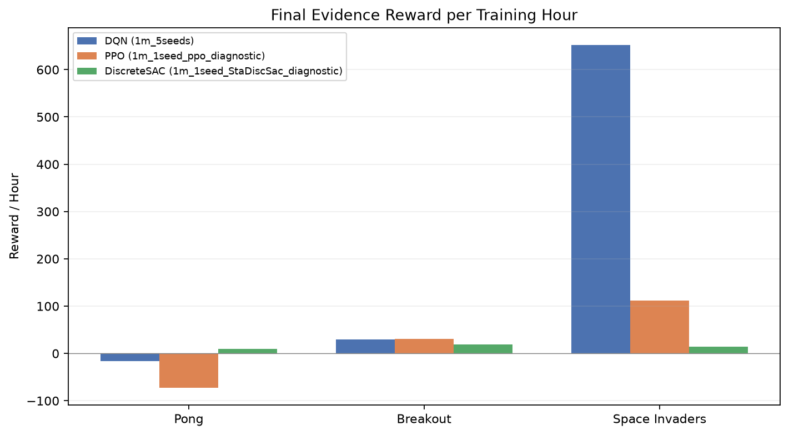

<div align="center">

**CISC 856 - Reinforcement Learning**

**Final Project Report**

Benchmarking DQN, PPO, and DiscreteSAC on Atari 2600 Games

**Group 4:**

Elsayed Elmandoh

Mohamed Hasan

Mohamed Zidan

Mostafa Elofy

</div>

\newpage

## 1 - Introduction

Atari 2600 environments are a standard testbed for deep reinforcement learning because they combine high-dimensional visual observations, delayed rewards, partial observability, action repeat, stochastic initial states, and game-specific control patterns. This project uses Atari as a compact but meaningful benchmark for comparing value-based, policy-gradient, and maximum-entropy reinforcement learning methods under a shared experimental pipeline.

The project focuses on three games: Pong, Breakout, and Space Invaders. These games were selected because they stress different learning behaviors. Pong requires fast paddle tracking and opponent reaction. Breakout requires paddle control, ball recovery, and sustained rallies. Space Invaders requires shooting, lateral positioning, and survival under incoming enemy fire. These differences make the benchmark more informative than testing a single Atari game.

The algorithms are DQN, PPO, and DiscreteSAC. DQN and PPO are implemented using Stable Baselines3 because they are mature reference baselines. SAC is more complicated: the standard Stable Baselines3 SAC implementation is for continuous action spaces, while Atari uses discrete action spaces. Therefore, this project uses a custom `DiscreteSAC` implementation with a categorical policy over the Atari action set.

The goal is not only to produce final reward numbers, but to build an end-to-end benchmark system that can be inspected and reproduced. The repository includes configuration files, source code, checkpoints, CSV result files, manifests, diagnostics, TensorBoard logs, input samples, and MP4 playback videos. This follows the project guidance in `docs/project-definition/making-a-rewarding-rl-project.md`: use existing tools where appropriate, define the RL problem rigorously, conduct comprehensive experiments, and discuss failures honestly.

The final evidence emphasized in this report is stored in three profile-scoped locations:

| Algorithm | Final playback folder | Final checkpoint/results folder |
|---|---|---|
| DQN | `artifacts/evaluation/playback/1m_5seeds/` | `evals/checkpoints/1m_5seeds/` |
| PPO | `artifacts/evaluation/playback/1m_1seed_ppo_diagnostic/` | `evals/checkpoints/1m_1seed_ppo_diagnostic/` |
| DiscreteSAC | `artifacts/evaluation/playback/1m_1seed_StaDiscSac_diagnostic/` | `evals/checkpoints/1m_1seed_StaDiscSac_diagnostic/` |

Older and shorter profiles are still discussed because they explain how the benchmark evolved, but the final comparison highlights the folders above.

## 2 - Problem Formulation

### Environment Set

The benchmark uses Gymnasium with the Arcade Learning Environment. Environment IDs are resolved through `configs/envs.json` and `src/utils/data_acquisition.py`.

| Game | Resolved environment | Main challenge |
|---|---|---|
| Pong | `ALE/Pong-v5` | Track ball position and move paddle reactively |
| Breakout | `ALE/Breakout-v5` | Keep ball alive, return shots, break bricks |
| Space Invaders | `ALE/SpaceInvaders-v5` | Shoot enemies while moving and avoiding bullets |

### State Space

At each time step, the raw Atari state is an RGB frame:

```text
s_raw in {0, ..., 255}^(210 x 160 x 3)
```

The benchmark does not feed raw RGB frames directly to the models. All algorithms share the same preprocessing pipeline from `configs/preprocessing.json`:

1. no-op reset with `noop_max = 30`;
2. frame skip/action repeat with `frame_skip = 4`;
3. grayscale conversion;
4. resize to `84 x 84`;
5. stack the four most recent processed frames.

The final model input is:

```text
s in {0, ..., 255}^(4 x 84 x 84)
```

The layout is channel-first `(C, H, W)`, dtype is `uint8`, and model code normalizes observations to `[0, 1]` before neural-network computation. The input contract is checked before training: shape, dtype, range, layout, contiguity, batch dimension, and prediction compatibility are validated.

### Action Space

Each Atari environment has a discrete action space:

```text
a in {0, 1, ..., n - 1}
```

Breakout uses four actions in this setup. Pong and Space Invaders use six actions, generally corresponding to combinations such as `NOOP`, `FIRE`, `RIGHT`, `LEFT`, `RIGHTFIRE`, and `LEFTFIRE`. Playback now records action meanings when available, because action counts are easier to interpret when the report can connect action IDs to game controls.

### Reward Function

The environment reward is the score delta returned by ALE:

```text
r_t = R(s_t, a_t, s_{t+1})
```

Training uses reward clipping where configured:

```text
clipped_reward = clip(r_t, -1, 1)
```

Evaluation reports accumulated game reward across full episodes. The benchmark records mean reward, standard deviation, minimum, maximum, wall-clock training time, reward per hour, checkpoint paths, diagnostics paths, playback paths, playback step counts, and playback action counts.

No custom shaping reward was added for aiming, dodging, or paddle tracking. For example, Space Invaders does not directly reward dodging bullets; survival is learned indirectly from longer episodes and continued scoring opportunities. This is important when interpreting weak Space Invaders policies that learn to shoot but do not dodge well.

## 3 - Solution Overview

### Repository Architecture

The project is organized as a reproducible benchmark pipeline.

| Path | Purpose |
|---|---|
| `app.py` | Main benchmark runner: profiles, locks, training, evaluation, playback, CSV/manifest writing |
| `configs/` | Algorithms, environments, preprocessing, profiles, model contracts, defaults |
| `src/config/` | Settings, logging, config loading, config hashing |
| `src/utils/` | Atari environment construction, wrappers, seed/device helpers |
| `src/models/` | DQN, PPO, DiscreteSAC, SB3 bridge, training/evaluation harness |
| `src/evaluation/` | Input validation, metadata, metrics, reporting helpers |
| `src/inference/` | Playback regeneration from saved checkpoints |
| `evals/` | Checkpoints, result CSVs, manifests, diagnostics, figures |
| `artifacts/` | Input frame samples and playback videos |
| `logs/` | TensorBoard event files and process logs |
| `docs/` | Proposal, project definition, reference guide, final report |

### Experiment Profiles

The benchmark is profile-based. A profile controls timesteps, seeds, evaluation episodes, and checkpoint frequency. Important profiles include:

| Profile | Purpose |
|---|---|
| `100k_1seed` | Early pilot across all algorithms and games |
| `200k_1seed` | Tuned pilot after initial stability issues |
| `300k_1seed_ppo_sac_improved` | Quick PPO and DiscreteSAC comparison, DQN excluded |
| `1m_5seeds` | Main DQN benchmark and multi-seed comparison folder |
| `1m_1seed_ppo_diagnostic` | PPO-only diagnostic run |
| `1m_1seed_StaDiscSac_diagnostic` | Stable DiscreteSAC diagnostic run |

Outputs are profile-scoped:

```text
evals/checkpoints/<profile>/
  <profile>_results_<timestamp>.csv
  <profile>_manifest_<timestamp>.json
  <game>/<algo>/seed_<seed>/
    final_model.zip       # DQN/PPO
    final_model.pt        # DiscreteSAC
    *_steps.zip or *.pt
    ppo_diagnostics.csv
    discrete_sac_diagnostics.csv

artifacts/evaluation/playback/<profile>/
  <game>/<algo>/*.mp4
```

### Algorithms

#### DQN

DQN is implemented with Stable Baselines3 using `CnnPolicy`. It is the most stable baseline in this project and should mostly be treated as the reference value-learning agent. It uses a replay buffer, target network updates, epsilon-greedy exploration, and one environment.

The final DQN evidence is:

- playback: `artifacts/evaluation/playback/1m_5seeds/`;
- checkpoints/results: `evals/checkpoints/1m_5seeds/`.

#### PPO

PPO is implemented with Stable Baselines3 using `CnnPolicy` and vectorized environments. It uses clipped policy optimization, generalized advantage estimation, entropy regularization, and eight environments. PPO was given a dedicated diagnostic profile because the earlier 300k playback looked collapsed: Pong repeated one action, Breakout showed weak short-episode paddle behavior, and Space Invaders repeated one action.

The PPO diagnostic profile added:

- PPO-specific diagnostics through `ppo_diagnostics.csv`;
- result CSV playback metadata;
- profile-specific checkpoint and playback folders.

The final PPO evidence is:

- playback: `artifacts/evaluation/playback/1m_1seed_ppo_diagnostic/`;
- checkpoints/results: `evals/checkpoints/1m_1seed_ppo_diagnostic/`.

#### DiscreteSAC

DiscreteSAC is custom because standard SB3 SAC is continuous-action. The project uses a categorical policy for Atari actions, twin Q networks, target Q networks, replay buffer storage, entropy temperature tuning, and diagnostics.

The DiscreteSAC implementation evolved significantly during the project. Earlier versions were fragile on Atari. Diagnostic work showed two separate issues:

1. the training algorithm needed more stable hyperparameters;
2. deterministic playback could make a non-deterministic policy look completely collapsed.

The final DiscreteSAC evidence is:

- playback: `artifacts/evaluation/playback/1m_1seed_StaDiscSac_diagnostic/`;
- checkpoints/results: `evals/checkpoints/1m_1seed_StaDiscSac_diagnostic/`.

### Problems Found And Solutions Implemented

The project improved through several debugging cycles. The main problems and fixes are summarized below.

| Problem | Evidence | Solution |
|---|---|---|
| Need to prevent overlapping runs in the same profile | Long runs could accidentally reuse the same output folder | Added profile locking in `app.py` |
| Need to run only selected algorithms | Diagnostics required PPO-only and DiscreteSAC-only runs | Added `--algo` support with multiple algorithm names |
| Need visual inspection, not only reward tables | Playback revealed behavior collapse that scores alone hid | Added MP4 playback recording per model/game/seed |
| Playback should match evaluation environment | Training wrappers and eval wrappers differed | Playback now uses eval env overrides |
| Results needed provenance | Hard to connect CSV rows to checkpoints/videos | CSV rows now include playback info and diagnostics path |
| PPO 300k playback looked collapsed | Repeated one action in Pong/Space Invaders | Added `1m_1seed_ppo_diagnostic` and `ppo_diagnostics.csv` |
| DiscreteSAC used continuous-SAC assumptions originally avoided | Atari actions are discrete | Kept custom `DiscreteSAC`, not SB3 continuous SAC |
| DiscreteSAC gradients/Q-values could become unstable | Early Space Invaders collapse and weak behavior | Added finite-gradient guards, clipping, action logging, diagnostics |
| Earlier DiscreteSAC deterministic playback repeated one action | Pong paddle did not move usefully; Space Invaders only fired | DiscreteSAC eval/playback now supports stochastic policy sampling |
| Breakout playback could stall after ball passed paddle | Video kept recording but ball was not served again | Added post-life FIRE wrapper for full-game eval/playback |
| Need easier playback regeneration | Multiline PowerShell commands were inconvenient | Added `python -m src.inference.record_playback <profile> <env>` |
| DiscreteSAC still underperformed reference Atari SAC recipes | Pong/Space Invaders policies remained weak | Updated recipe toward reference Atari SAC: higher entropy target, min-Q backup, delayed updates, larger batch, target refresh cadence |

## 4 - Results

This section reports all major benchmark evidence, but highlights the final result folders requested for each algorithm.

### Final Evidence Folders

| Algorithm | Final profile | Playback evidence | Checkpoint/result evidence |
|---|---|---|---|
| DQN | `1m_5seeds` | `artifacts/evaluation/playback/1m_5seeds/` | `evals/checkpoints/1m_5seeds/` |
| PPO | `1m_1seed_ppo_diagnostic` | `artifacts/evaluation/playback/1m_1seed_ppo_diagnostic/` | `evals/checkpoints/1m_1seed_ppo_diagnostic/` |
| DiscreteSAC | `1m_1seed_StaDiscSac_diagnostic` | `artifacts/evaluation/playback/1m_1seed_StaDiscSac_diagnostic/` | `evals/checkpoints/1m_1seed_StaDiscSac_diagnostic/` |

### Evaluation Figures

The generated figures are stored in `evals/figures/`. They summarize the benchmark from complementary views: mean reward, best observed reward, reward normalized by wall-clock time, and training time.


**Figure 1. Mean reward.** This plot compares average evaluation reward across benchmark conditions. It is the main quantitative view for judging final policy performance.



**Figure 2. Maximum reward.** This plot shows the best episode score reached in evaluation. It helps identify policies that occasionally perform well even when their mean performance is unstable.



**Figure 3. Reward per hour.** This plot normalizes reward by training wall-clock time. It is useful because PPO, DQN, and custom DiscreteSAC have very different runtime costs.


**Figure 4. Training time.** This plot compares wall-clock training time. It highlights the engineering cost of the custom DiscreteSAC loop relative to the Stable Baselines3 implementations.

### DQN Final Results: `1m_5seeds`

DQN is the most stable final baseline. The `1m_5seeds` profile contains five seeds for each game. Each seed was evaluated over 100 episodes.

| Game | Seeds | Mean of seed means | Seed std | Best episode max |
|---|---:|---:|---:|---:|
| Pong | 5 | -8.14 | 9.27 | 19 |
| Breakout | 5 | 14.66 | 3.29 | 43 |
| Space Invaders | 5 | 324.66 | 23.64 | 895 |

Interpretation: DQN learned the strongest overall policies among the completed stable baselines. It was especially strong on Space Invaders and produced the best completed multi-seed Pong performance. The Pong seed standard deviation is high, which means DQN is sensitive to random seed at the 1M-step budget, but it still shows meaningful learning in some seeds.

### PPO Final Diagnostic Results: `1m_1seed_ppo_diagnostic`

The PPO final evidence comes from the dedicated 1M diagnostic profile. This profile was created because earlier 300k playback looked collapsed and because reference Atari PPO setups often require much larger budgets than 300k.

| Game | Seed | Mean | Std | Max | Playback steps | Playback action counts |
|---|---:|---:|---:|---:|---:|---|
| Pong | 0 | -14.60 | 7.20 | -3 | 2,362 | `{"2": 1259, "3": 1082, "5": 21}` |
| Breakout | 0 | 6.93 | 2.39 | 9 | 5,000 | `{"0": 4861, "1": 68, "2": 35, "3": 36}` |
| Space Invaders | 0 | 25.03 | 4.55 | 31 | 843 | `{"4": 345, "5": 498}` |

Interpretation: PPO improved over the short 300k diagnostic in Pong but remained weak overall at this configuration. Breakout learned some paddle behavior but did not match the main DQN benchmark. Space Invaders remained particularly weak in this PPO diagnostic. The diagnostic result suggests undertraining and/or hyperparameter mismatch rather than a broken pipeline, because PPO action diagnostics and playback show nontrivial but low-quality behavior.

### DiscreteSAC Final Diagnostic Results: `1m_1seed_StaDiscSac_diagnostic`

The final DiscreteSAC evidence comes from the Stable DiscreteSAC diagnostic profile after the playback and training-recipe fixes discussed above.

| Game | Seed | Mean | Std | Max | Playback steps | Playback action counts |
|---|---:|---:|---:|---:|---:|---|
| Pong | 42 | 18.77 | 2.51 | 21 | 1,650 | `{"0": 310, "1": 270, "2": 196, "3": 314, "4": 229, "5": 331}` |
| Breakout | 42 | 37.42 | 12.02 | 85 | 1,021 | `{"0": 281, "1": 280, "2": 219, "3": 241}` |
| Space Invaders | 42 | 29.44 | 5.56 | 49 | 1,217 | `{"0": 221, "1": 234, "2": 143, "3": 222, "4": 180, "5": 217}` |

Interpretation: the final DiscreteSAC diagnostic is much better than the earlier collapsed playback behavior. Pong and Breakout improved substantially in this one-seed diagnostic, and action counts show that playback is no longer stuck on one deterministic action. Space Invaders still remains weak: it samples across actions but does not yet show strong aiming or dodging. This matches the qualitative observation that Space Invaders requires longer-horizon credit assignment and may need more timesteps or a closer SD-SAC implementation.

### Broader Benchmark Context

Older pilot profiles are still useful for understanding the project development.

| Profile | Algorithm | Pong | Breakout | Space Invaders |
|---|---|---:|---:|---:|
| `100k_1seed` | DQN | -21.00 | 7.65 | 187.50 |
| `100k_1seed` | PPO | -21.00 | 0.00 | 285.00 |
| `100k_1seed` | DiscreteSAC | -21.00 | 0.00 | 168.25 |
| `200k_1seed` | DQN | -21.00 | 8.25 | 170.00 |
| `200k_1seed` | PPO | -21.00 | 2.70 | 285.00 |
| `200k_1seed` | DiscreteSAC | -21.00 | 0.00 | 0.00 |

The short pilots showed that 100k-200k timesteps were not enough for reliable Pong behavior and that the earlier DiscreteSAC settings were fragile. These failures were useful because they led to the diagnostic profiles, action logging, playback generation, stochastic DiscreteSAC playback, and the newer stable recipe.

### Qualitative Playback Findings

Playback videos changed the interpretation of the numeric results. PPO and DiscreteSAC sometimes produced action distributions that looked acceptable in CSV form but poor in video. The most important qualitative observations were:

- Pong requires coherent ball tracking; random-looking paddle movement is not enough.
- Breakout can look good until life loss; without post-life FIRE handling, full-game video can appear stuck.
- Space Invaders can get nonzero score by shooting, but a good policy should also move, aim, and dodge.

This is why the final benchmark keeps both CSV metrics and MP4 playback videos.

## 5 - Conclusion

This project produced a complete Atari RL benchmarking pipeline and a set of interpretable results across DQN, PPO, and DiscreteSAC. The project includes the core elements expected from a rigorous RL benchmark: defined observation/action/reward spaces, shared preprocessing, controlled configurations, checkpointing, result CSVs, manifests, diagnostics, logs, and playback videos.

The strongest final baseline is DQN. In the `1m_5seeds` profile, DQN achieved the best overall completed multi-seed performance, especially on Space Invaders and Pong. PPO was faster wall-clock and useful as a standard policy-gradient baseline, but the final PPO diagnostic remained weaker than expected at 1M steps. DiscreteSAC required the most debugging because it is custom and less standardized for Atari. After the fixes, the final DiscreteSAC diagnostic improved strongly on Pong and Breakout, but Space Invaders still needs more work.

The main technical problems solved during the project were:

- separating profile outputs and preventing overlapping runs with locks;
- adding algorithm filtering for focused diagnostics;
- adding playback videos and playback metadata;
- adding PPO and DiscreteSAC diagnostics;
- keeping SAC discrete rather than incorrectly using continuous SAC;
- fixing DiscreteSAC numerical and policy-collapse issues;
- fixing Breakout full-game playback after life loss;
- adding a one-line playback regeneration helper;
- moving DiscreteSAC hyperparameters closer to reference Atari SAC practice.

The main lesson is that reward tables alone are not enough. A policy can score nonzero while behaving poorly, especially in Space Invaders. Playback and diagnostics are necessary to understand whether an agent is actually learning the intended behavior.

Recommended future work:

1. Run a multi-seed version of the final improved DiscreteSAC diagnostic.
2. Increase PPO and DiscreteSAC budgets beyond 1M timesteps if time permits.
3. Add confidence intervals and formal seed-level statistical tests.
4. Add closer SD-SAC features such as n-step returns and stored entropy penalties.
5. Parse TensorBoard logs into learning curves for the final report figures.

References used for method direction:

1. Schulman, J., Wolski, F., Dhariwal, P., Radford, A., and Klimov, O. "Proximal Policy Optimization Algorithms." arXiv:1707.06347, 2017. https://arxiv.org/abs/1707.06347
2. Haarnoja, T., Zhou, A., Abbeel, P., and Levine, S. "Soft Actor-Critic: Off-Policy Maximum Entropy Deep Reinforcement Learning with a Stochastic Actor." Proceedings of ICML, 2018. https://arxiv.org/abs/1801.01290
3. Christodoulou, P. "Soft Actor-Critic for Discrete Action Settings." arXiv:1910.07207, 2019. https://arxiv.org/abs/1910.07207
4. Stable Baselines3 Contributors. "Stable Baselines3 Documentation: DQN and PPO." https://stable-baselines3.readthedocs.io/
5. Huang, S., Dossa, R. F. J., Raffin, A., Kanervisto, A., and Wang, W. "CleanRL: High-quality single-file implementations of deep reinforcement learning algorithms." Journal of Machine Learning Research, 2022. https://github.com/vwxyzjn/cleanrl
6. Zhou, H., Lan, T., and Aggarwal, V. "Revisiting Discrete Soft Actor-Critic." arXiv:2209.10081, 2022. https://arxiv.org/abs/2209.10081

Project repository: [elsayedelmandoh/atari-rl-benchmarking](https://github.com/elsayedelmandoh/atari-rl-benchmarking)
